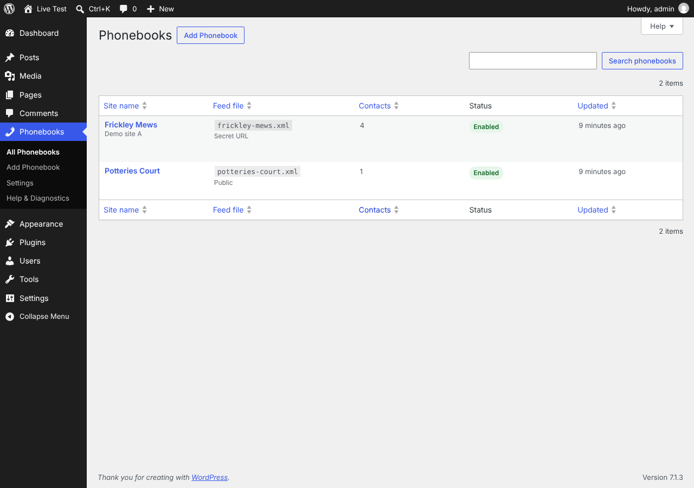
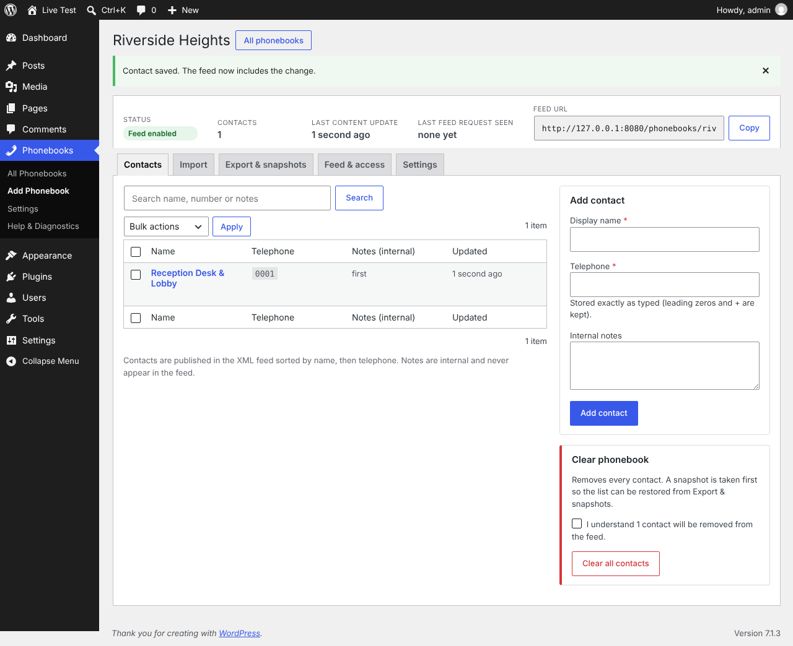
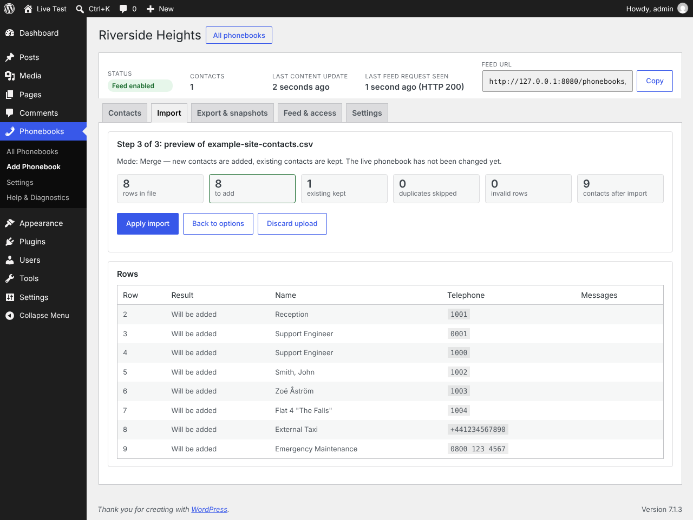
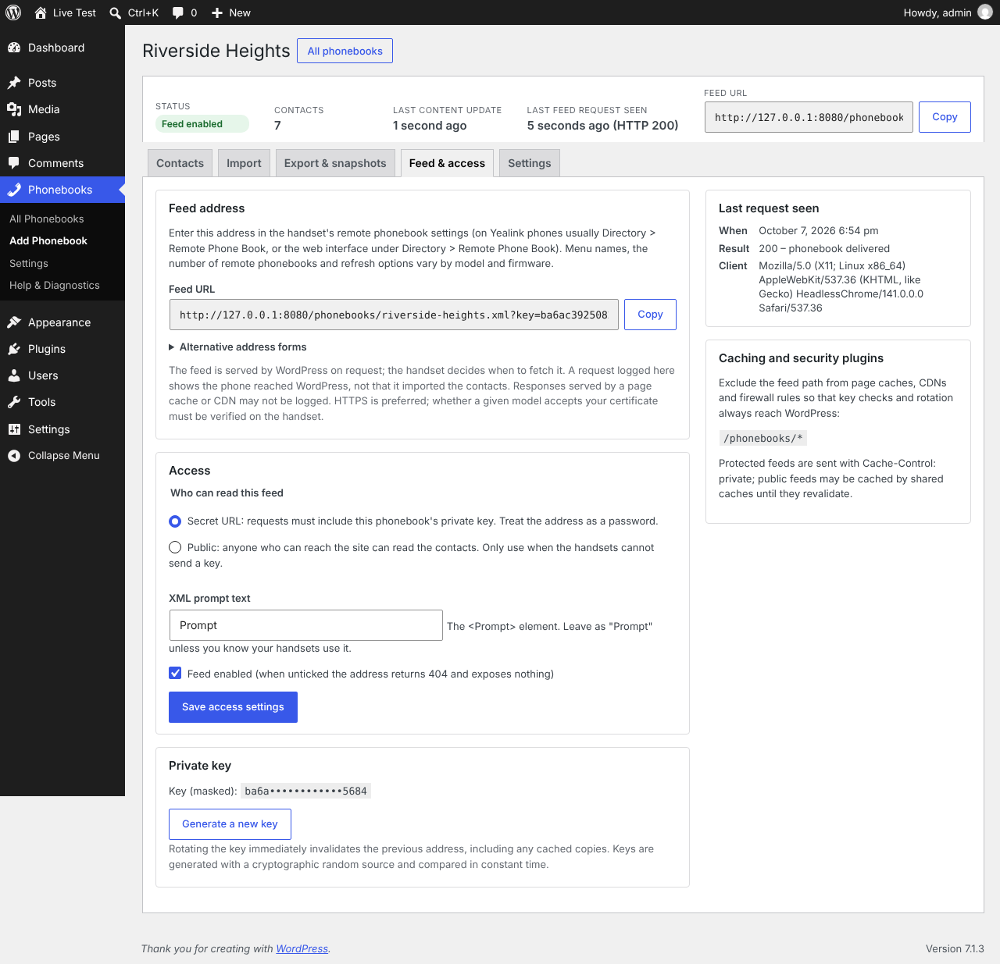
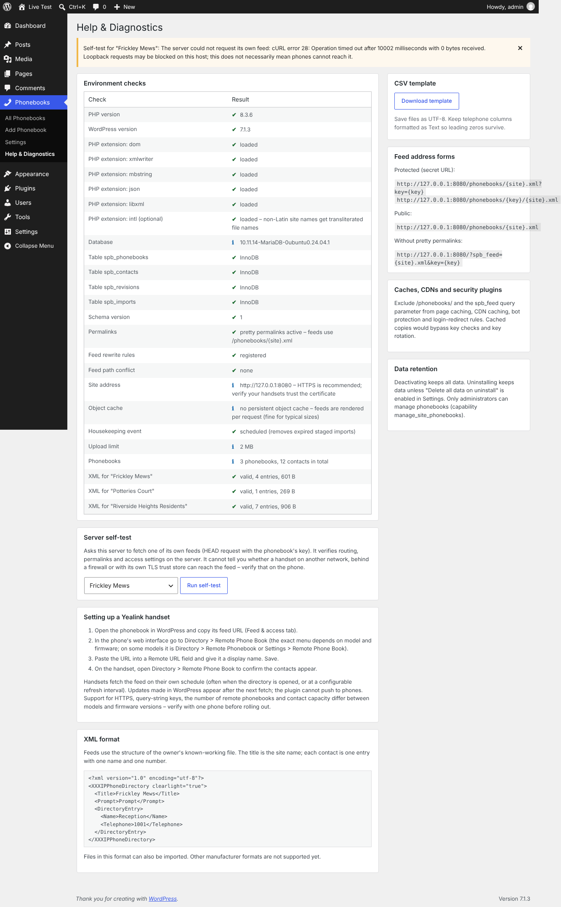

# Site Phonebooks – User guide

This guide covers the day-to-day workflows: creating a phonebook, managing contacts, importing and exporting, protecting the feed and configuring a Yealink handset. Everything happens under the **Phonebooks** menu in the WordPress dashboard (administrators only).



## 1. Create a site phonebook

1. Go to **Phonebooks → Add Phonebook**.
2. Enter the **site name** (for example *Frickley Mews*). Names must be unique; the plugin blocks duplicates, including the same name in different capitalisation.
3. Optionally add an internal description (never shown on handsets).
4. Choose the feed access: **Secret URL** (default and recommended) or **Public**.
5. Click **Create phonebook**.

The plugin derives a readable file name from the site name (`frickley-mews.xml`). Two sites whose names reduce to the same file name get `-2`, `-3` suffixes; nothing is ever overwritten. Site names in non-Latin scripts are transliterated where the server has the PHP `intl` extension, otherwise they become `phonebook.xml`, `phonebook-2.xml`, and so on. You can change the file name later on the **Settings** tab.

The summary strip at the top of every phonebook shows status, contact count, last content update, the last feed request WordPress saw and the feed URL with a **Copy** button.

## 2. Add, edit and remove contacts



On the **Contacts** tab:

- **Add**: fill in *Display name* and *Telephone* (and optional internal *Notes*) in the side panel and click **Add contact**. Telephone values are kept exactly as typed: leading zeros, `+`, spaces and brackets survive.
- **Edit**: click a name (or *Edit*) to load it into the side panel, change it and **Save changes**.
- **Delete**: use the *Delete* row action (asks for confirmation) or tick several contacts, choose *Delete selected* and click **Apply**. Bulk deletes show a confirmation panel and take a snapshot first.
- **Search** by name, number or notes; results are paginated 50 per page.
- **Clear phonebook** (side panel, danger zone) removes every contact after a snapshot.

Rules:

- Names are trimmed and internal whitespace runs are collapsed to one space. Telephones are only trimmed.
- The same display name may appear several times with different numbers (for example two *Support Engineer* entries). An exact duplicate (same name **and** number) is rejected.
- Control characters and text that cannot be represented in XML are rejected with an explanation.
- Notes are internal and never appear in the XML.

Every change becomes available in the feed immediately; handsets pick it up the next time they fetch the feed.

## 3. Import a CSV file

The **Import** tab offers a three-step flow. Nothing in the live phonebook changes until you confirm on step 3.

**Step 1 – Upload.** Choose the CSV (or XML) file and click **Upload and continue**. A template is available on the same screen:

```csv
Name,Telephone
Reception,1001
Support Engineer,0001
External Contact,+441234567890
```

Supported: UTF-8 with or without BOM (UTF-16 with BOM is converted automatically), Windows/Mac/Unix line endings, quoted values, commas inside quoted names, comma / semicolon / tab separators (detected, with a manual override). Files that are not UTF-8 are reported instead of being imported with mangled accents; you can then either re-save the file as UTF-8 or explicitly select *Windows-1252* / *ISO-8859-1*.

Limits (Phonebooks → Settings): 2 MB and 5,000 rows by default.

> **Leading zeros:** spreadsheet software often turns `0001` into `1` and `+441234` into a number when it *opens* a CSV. The plugin never alters the text in the file you upload, but it cannot restore digits that were already lost. Format telephone columns as *Text* before saving.

**Step 2 – Options.** Review the detected separator, header row and encoding; map which columns hold the **Name**, **Telephone** and optional **Notes** (any header names work; `Name`/`Telephone`/`Extension`/`Display Name` etc. are guessed). Choose a mode:

- **Merge** – adds new contacts and keeps every existing one. Rows whose name *and* telephone exactly match an existing contact (after the whitespace normalisation above) are skipped. A matching name with a *different* number becomes a separate contact: merge does not detect number changes. Edit those by hand, or use Replace.
- **Replace** – the file becomes the complete list. Existing contacts that are not in the file are removed; those that are in the file are kept untouched (including their notes and IDs). A snapshot is taken first. An import that would leave the phonebook empty is refused; use *Clear phonebook* for that.

Tick **Import valid rows only** to skip invalid rows instead of blocking the import.

**Step 3 – Preview.**



The preview shows counts (rows in file, to add, existing kept, duplicates skipped, existing to remove, invalid, contacts after import) and every row with its result and source row number. Invalid rows are listed first with the reason. For Replace you must tick the confirmation stating how many existing contacts will be removed. Click **Apply import**.

The plan you previewed is exactly what gets applied. If anyone changes the phonebook between preview and apply, the import is refused and you are asked to build a fresh preview. If the database fails mid-way, the whole import is rolled back and the previous list (and feed) stays intact. Uploads and previews that are not applied are deleted automatically (60 minutes by default) or with **Discard upload**.

## 4. Import an XML file

Upload a file in the working Yealink format (`<XXXIPPhoneDirectory>` with `<DirectoryEntry><Name/><Telephone/></DirectoryEntry>`). Step 2 shows the title and entry count and offers **Rename this phonebook to the XML title** (off by default; the feed address never changes). Everything else works as for CSV. Malformed files, other structures, DOCTYPE/entity declarations, oversized files and non-UTF-8 files are rejected without touching the phonebook.

## 5. Export and recover

**Export & snapshots** tab:

- **Download XML** – identical to the feed.
- **Download CSV** – `Name,Telephone,Notes`. Cells that a spreadsheet could execute as a formula (starting with `=`, `@`, or `+`/`-` followed by non-numeric text) are prefixed with an apostrophe; the importer removes that apostrophe again, so exports re-import unchanged. Telephone-like values such as `+441234567890` or `0001` are written as-is.
- **Snapshots** are taken automatically before replace imports, bulk deletes, clears and restores, and manually with **Take a snapshot now**. The newest 10 per phonebook are kept (configurable). **Preview** shows a snapshot's contacts; **Restore** replaces the current list with it (after snapshotting the current list) and publishes a new feed revision.

## 6. Feed & access



- **Feed address** – the URL to configure on handsets, with a copy button. *Alternative address forms* shows the path-key variant (`/phonebooks/{key}/frickley-mews.xml`) for handsets that drop query strings, and the fallback that works without pretty permalinks.
- **Access** – Secret URL or Public; the XML `<Prompt>` text; enable/disable the feed (disabled feeds return 404 and expose nothing).
- **Private key** – shown masked. **Generate a new key** immediately invalidates the old address (including cached copies); every handset must then be updated.
- **Last request seen** – when WordPress last served this feed, the HTTP status (200 delivered, 304 unchanged, 403 wrong/missing key, 404 disabled) and the client's user agent (Yealink phones report model and firmware here). A logged request proves the phone reached WordPress, not that it imported the contacts; requests answered by a page cache or CDN are not logged.

Treat the secret URL as a password: do not paste it into tickets or chat, and rotate it if it leaks.

## 7. Configure a Yealink handset

Exact menus differ by model and firmware; these are the common locations.

1. Copy the feed URL from the **Feed & access** tab.
2. Log in to the phone's web interface and open **Directory → Remote Phone Book** (on some firmware *Directory → Remote Phonebook* or *Settings → Remote Phone Book*).
3. Paste the URL into a *Remote URL* field, give it a *Display Name* (the site name is a good choice) and **Confirm/Save**.
4. On the handset open **Directory → Remote Phone Book** (or press the Directory key) and check the contacts appear.

Notes and caveats to verify on your own handsets:

- Phones fetch the feed on their own schedule: usually when the remote phonebook is opened, and/or at a refresh interval that can be set in the web interface or via provisioning. WordPress publishes changes instantly, but a phone shows them only after its next fetch. The plugin does not push to phones.
- Whether a model follows `?key=` query strings, accepts the path-key form, supports HTTPS with your certificate, or limits the number of remote phonebooks and contacts depends on model and firmware. Test with one phone first.
- Some firmware caches aggressively or ignores `ETag`; the feed also sends `Last-Modified` and works without conditional requests.
- The `clearlight="true"` attribute and the `<Prompt>` element are kept exactly as in the known-working file; the plugin does not infer any behaviour from them.

## 8. Settings (Phonebooks → Settings)

- Default access for new phonebooks (Secret URL / Public).
- Maximum rows and file size per import; how long unfinished imports are kept.
- Snapshots kept per phonebook.
- Cache `max-age` sent with feeds (0 by default: clients revalidate every time).
- Delete all data on uninstall (off by default).

## 9. Help & Diagnostics



Shows environment checks (PHP version and extensions, database engine, schema version, permalinks and rewrite rules, HTTPS, object cache, housekeeping event, upload limit) and validates the XML of every phonebook. **Server self-test** asks the server to fetch one of its own feeds; it confirms routing and access settings on the server but cannot prove reachability from a phone's network. The page also has the CSV template, the feed address forms, cache-exclusion guidance and the data retention policy.

## 10. Caching, CDNs and security plugins

Exclude `/phonebooks/*` (and requests with the `spb_feed` query parameter) from page caching, CDN caching, bot protection and "redirect to login" rules. Protected feeds are sent with `Cache-Control: private, no-cache`; a shared cache that ignores this could serve a feed without checking the key or after a key rotation.
